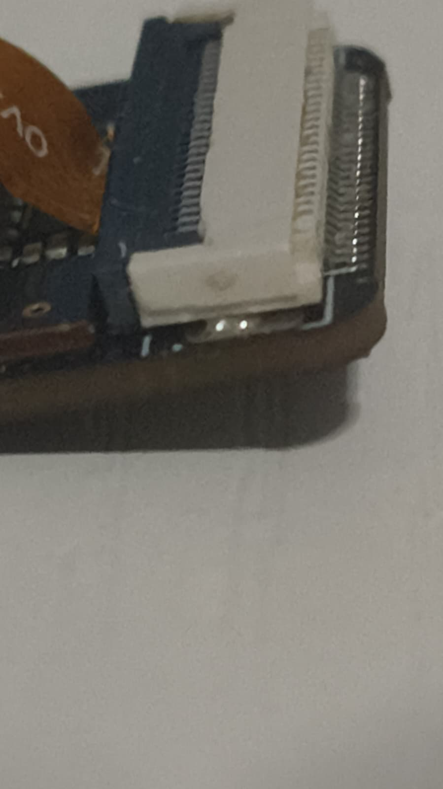
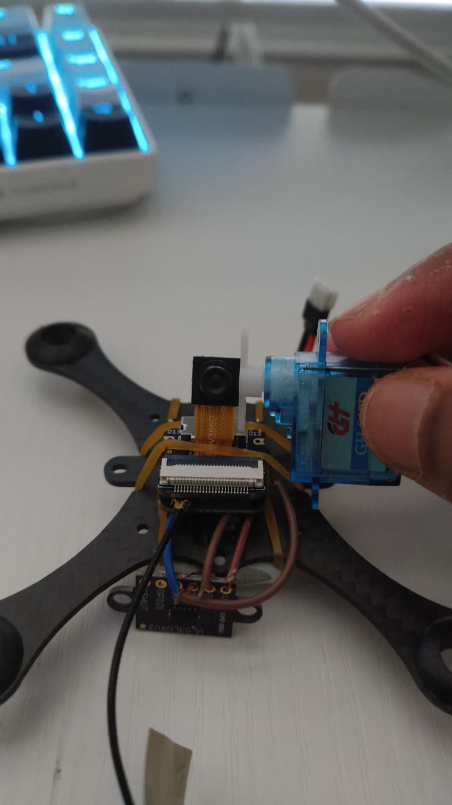

# <name it>

<!-- ONE SENTENCE. What is it, said out loud to a friend. -->

## What it does
<!-- What does the drone actually do right now? Be honest about what works and
     what doesn't. "Four motors spin, sensors map, it does not fly yet" is a
     better opening than implying it flies. -->

## Why I built it
<!-- You have a real answer to this one. Use it. -->

## How it works
<!-- Three or four short paragraphs. Prompts:
     - the map is log-odds, not true/false. Why does that matter when a real
       VL53L0X returns garbage off a dark surface?
     - one beam plus rotation IS a multi-beam scan spread over time
     - what does the gyro bias calibration at boot fix? What happens without it?
     - why does every VL53L0X need XSHUT sequencing at every boot? -->

## Wiring
See [docs/WIRING.md](docs/WIRING.md).

## Firmware
| file | what it does |
|---|---|
| `firmware/drone_slam.ino` | main - sensors, heading, occupancy grid, UDP telemetry |
| `firmware/imu_bringup.ino` | MPU6050 bring-up with a full I2C bus scan |
| `firmware/tof_bringup.ino` | re-addresses all four ToF sensors off 0x29 |
| `firmware/cam_diag.ino` | camera fault diagnosis |

## Software
<!-- occupancy.py, explorer.py, localize.py, sim.py - one line each -->

## Bill of materials
See [BOM.csv](BOM.csv).

## What I got wrong
<!-- The best section. You have plenty:
     - four solder joints that held mechanically and conducted nothing
     - motors that only crackled - IN2/IN4 floating on the second driver
     - the gyro reading zeros because of a bridge to the metal shield
     - cutting the header pins with craft scissors -->

## Status / next
<!-- Honest. What's left before it flies? -->
